# 

### A simple and fast text-saving app for quick copy-pasting

 

---

## 🚀 **Overview**

One-Clip is a **modern, lightweight web application** that helps you save and quickly copy-paste text snippets with a single click. It is designed for efficiency and accessibility, ensuring your saved text is always available whenever needed.

## 🎯 **Key Features**

-   ✅ **Rich Text Format**: Rich text format with Hyperlinks.
-   ✅ **One-click Copy**: Click on any saved text to copy it instantly.
-   ✅ **Google Authentication**: Secure sign-in with your Google account.
-   ✅ **Auto-Save**: All text entries are saved automatically.
-   ✅ **Search Bar**: Quickly find saved snippets.
-   ✅ **Select All**: Select and delete the notes quick.
-   ✅ **Sort Notes By**: Sort notes by various categories.
-   ( All of the above 3 are designed to work together as well! )
-   ✅ **Note Context Menu**: For important settings.
-   ✅ **Export/Import**: Backup or transfer your saved snippets as a JSON file.
-   ✅ **MongoDB Atlas**: Secure, scalable NoSQL database.
-   ✅ **Prisma ORM**: Efficient, type-safe data management.
-   ✅ **Mobile Responsive**: Works smoothly on desktops, tablets, and mobile devices.

---

## 🛠 **Tech Stack**

-   **Frontend**: Next.js (App Router), React.js, TypeScript, Tailwind CSS
-   **Backend**: Next.js APIs,
-   **Authentication**: NextAuth.js (Google Sign-In)
-   **Database**: MongoDB Atlas with Prisma ORM
-   **UI Components**: ShadCN-UI
-   **Deployment**: Free hosting service

---

## 🚀 **Getting Started**

### 1️⃣ **Clone the Repository**

```sh
  git clone https://github.com/adi-sd/one-clip.git
  cd one-clip
```

### 2️⃣ **Install Dependencies**

```sh
  npm install
```

### 3️⃣ **Set Up Environment Variables**

Create a `.env.local` file in the root directory and add:

```env
GOOGLE_CLIENT_ID=your-google-client-id
GOOGLE_CLIENT_SECRET=your-google-client-secret
NEXTAUTH_SECRET=your-random-secret-key
NEXTAUTH_URL=http://localhost:3000

DATABASE_URL="mongodb+srv://<username>:<password>@<cluster>.mongodb.net/one-clip?retryWrites=true&w=majority"
```

> 🔹 Replace `<username>`, `<password>`, and `<cluster>` with your actual **MongoDB Atlas credentials**.

---

### 4️⃣ **Set Up Prisma & Migrate Database**

Run the following commands to set up Prisma ORM and apply migrations:

```sh
  npx prisma generate
  npx prisma migrate dev --name init
```

This initializes Prisma and creates the necessary tables in **MongoDB Atlas**.

---

### 5️⃣ **Run the Development Server**

```sh
  npm run dev
```

Open [http://localhost:3000](http://localhost:3000) in your browser.

---

## 📸 Screenshots

### Mobile

<!-- markdownlint-disable MD033 -->
<div style="display: flex; flex-wrap: wrap; gap: 10px; justify-content: center">
  <div style="width: 200px; margin: 10px">
    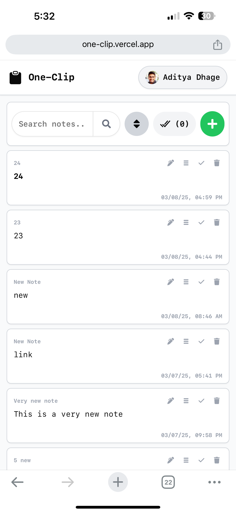
    <div style="text-align: center; font-size: 0.9em">Dashboard</div>
  </div>
  <!-- <div style="width: 200px; margin: 10px">
    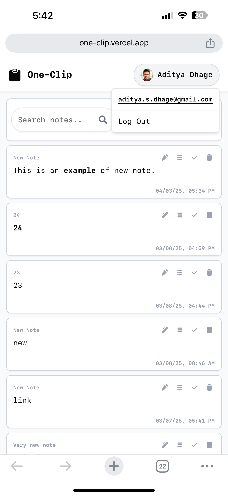
    <div style="text-align: center; font-size: 0.9em">User Context</div>
  </div> -->
  <div style="width: 200px; margin: 10px">
    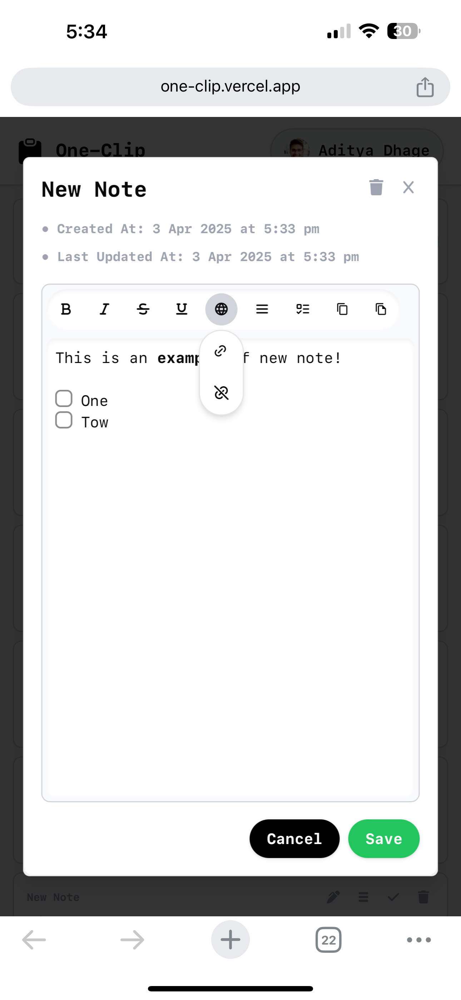
    <div style="text-align: center; font-size: 0.9em">Rich Text Editor</div>
  </div>
  <div style="width: 200px; margin: 10px">
    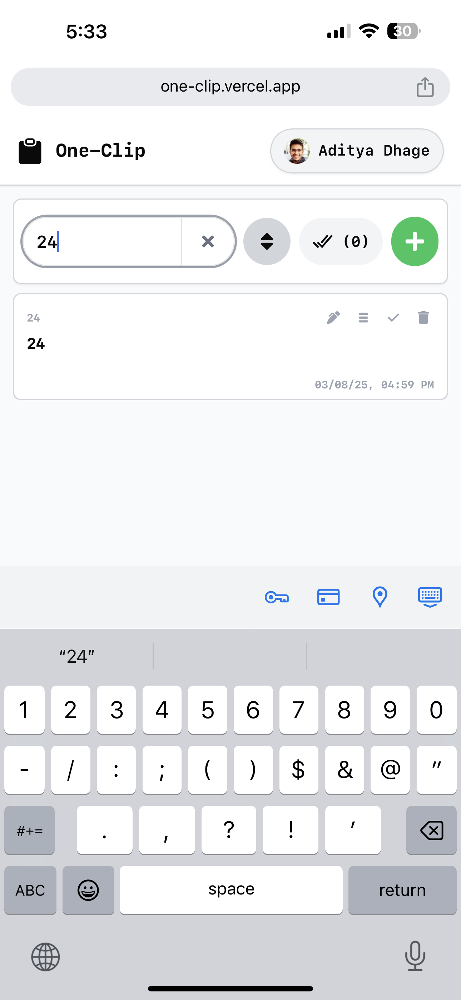
    <div style="text-align: center; font-size: 0.9em">Search</div>
  </div>
  <div style="width: 200px; margin: 10px">
    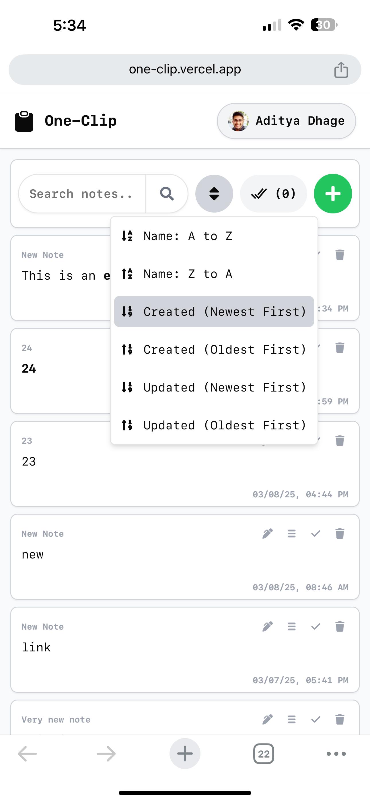
    <div style="text-align: center; font-size: 0.9em">Sort</div>
  </div>
  <div style="width: 200px; margin: 10px">
    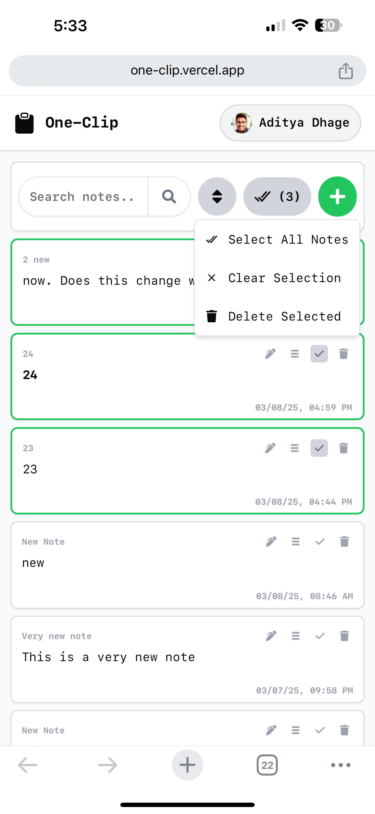
    <div style="text-align: center; font-size: 0.9em">Select</div>
  </div>
  <div style="width: 200px; margin: 10px">
    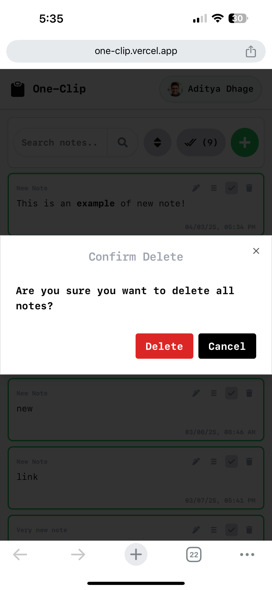
    <div style="text-align: center; font-size: 0.9em">Delete Confirmation</div>
  </div>
</div>

### Desktop

<div style="display: flex; flex-wrap: wrap; gap: 10px; justify-content: center">
  <div style="width: 200px; margin: 10px">
    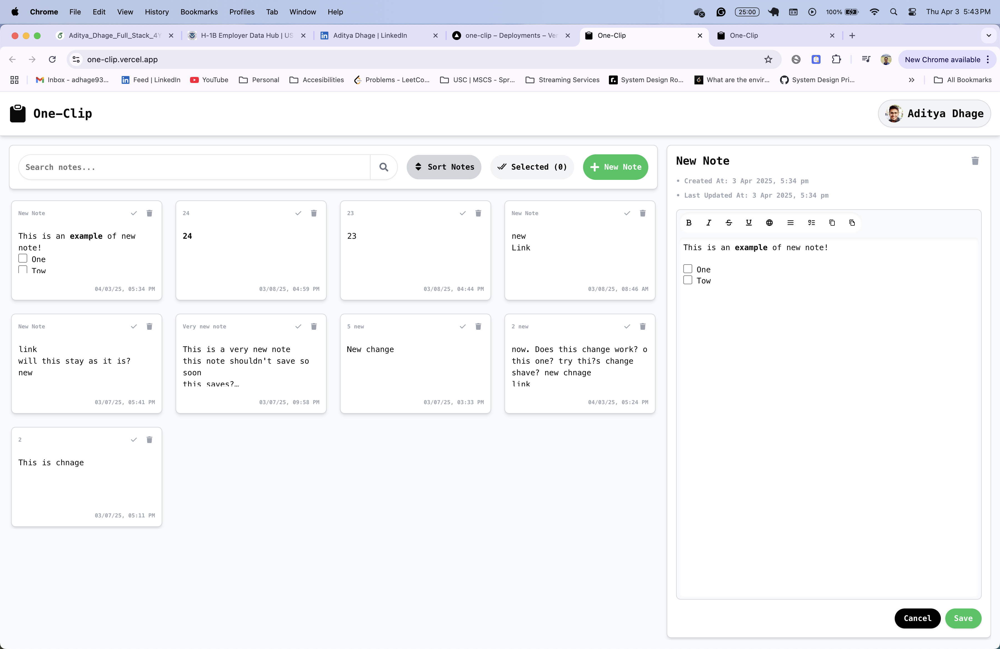
    <div style="text-align: center; font-size: 0.9em">Dashboard</div>
  </div>
  <!-- <div style="width: 200px; margin: 10px">
    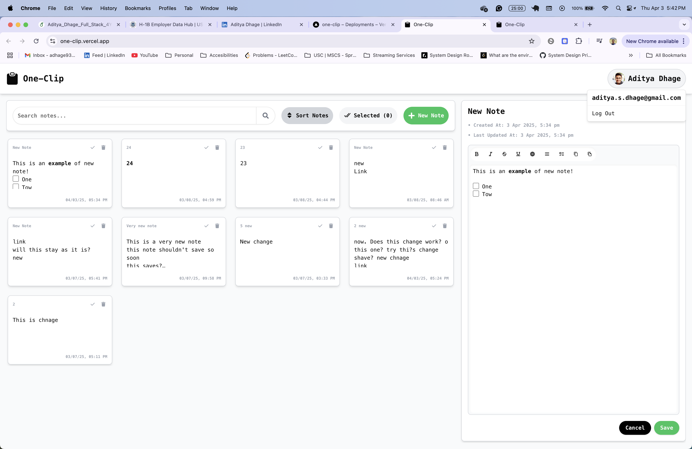
    <div style="text-align: center; font-size: 0.9em">User Context</div>
  </div> -->
  <div style="width: 200px; margin: 10px">
    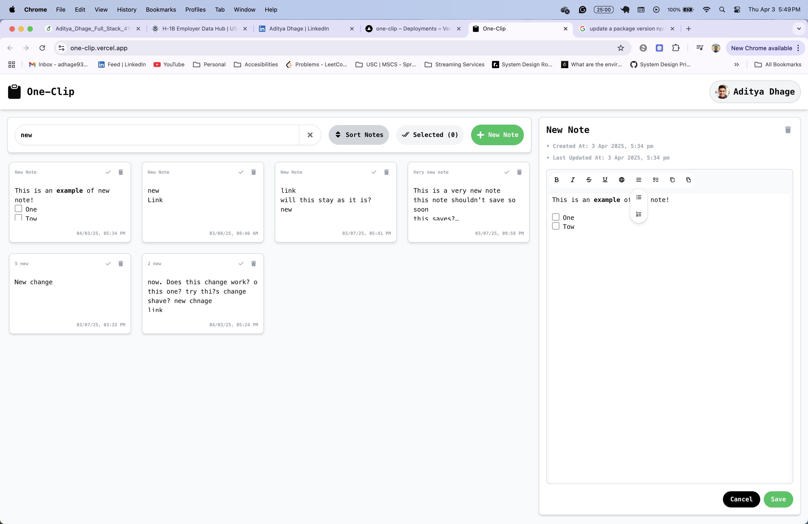
    <div style="text-align: center; font-size: 0.9em">Rich Text Editor</div>
  </div>
  <div style="width: 200px; margin: 10px">
    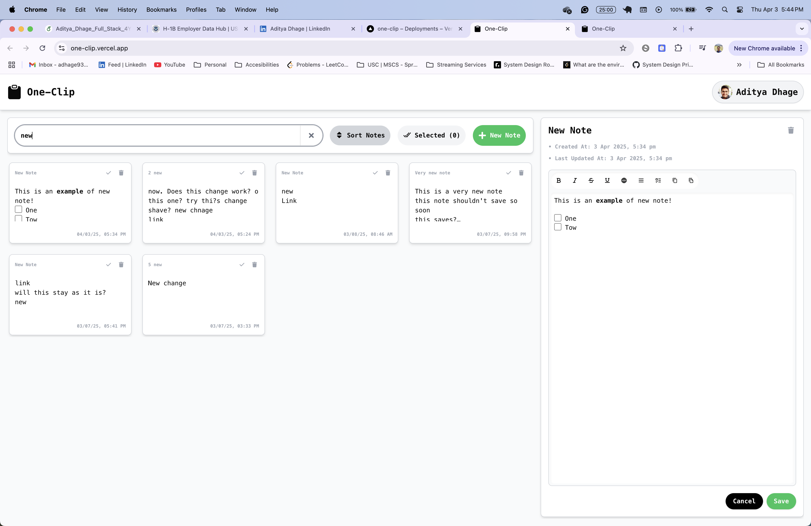
    <div style="text-align: center; font-size: 0.9em">Search</div>
  </div>
  <div style="width: 200px; margin: 10px">
    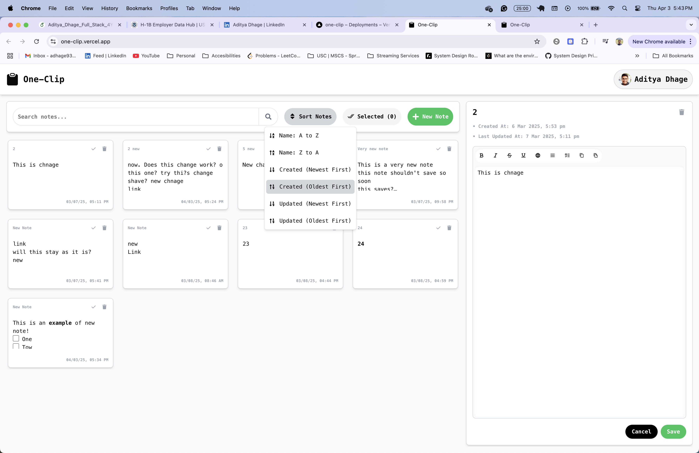
    <div style="text-align: center; font-size: 0.9em">Sort</div>
  </div>
  <div style="width: 200px; margin: 10px">
    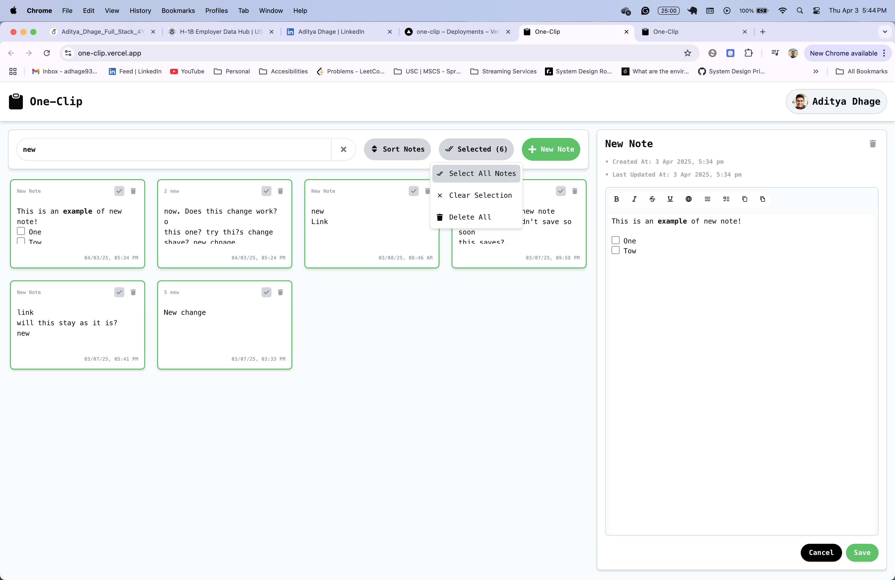
    <div style="text-align: center; font-size: 0.9em">Select</div>
  </div>
  <div style="width: 200px; margin: 10px">
    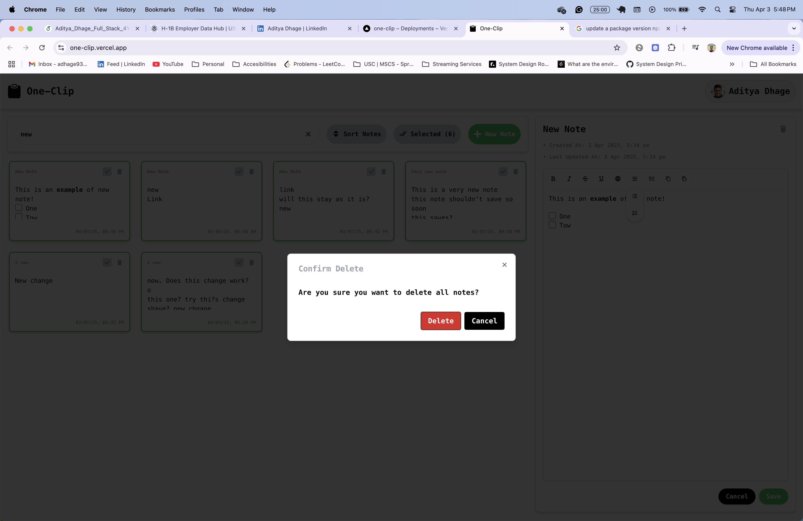
    <div style="text-align: center; font-size: 0.9em">Delete Confirmation</div>
  </div>
</div>
<!-- markdownlint-enable MD033 -->

---

## 🛠 **Deployment**

To deploy, configure environment variables for your hosting provider and push the project.

If using **Vercel**, set environment variables in **Vercel Dashboard** and deploy:

```sh
  vercel deploy
```

---

## 📝 **Contributing**

1. Fork the repo
2. Create a new branch (`git checkout -b feature-branch`)
3. Commit your changes (`git commit -m 'Add feature'`)
4. Push to the branch (`git push origin feature-branch`)
5. Open a pull request

---

## 🛡 **License**

This project is licensed under the **MIT License**.

---

## 📬 **Contact**

For any issues or feature requests, feel free to [open an issue](https://github.com/adi-sd/one-clip/issues) or connect with me on GitHub: [@adi-sd](https://github.com/adi-sd)

---

⭐ **If you like this project, don’t forget to star the repository!** ⭐
